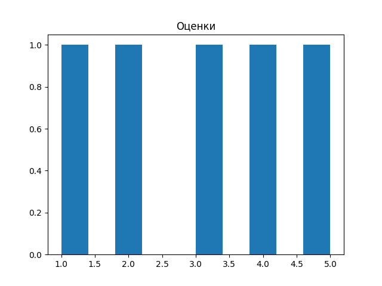
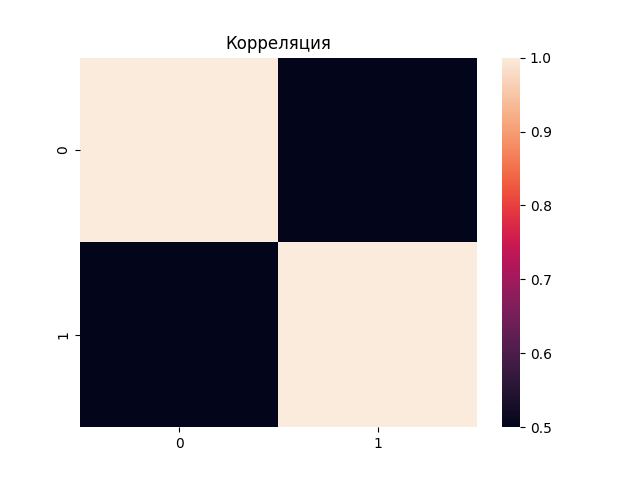
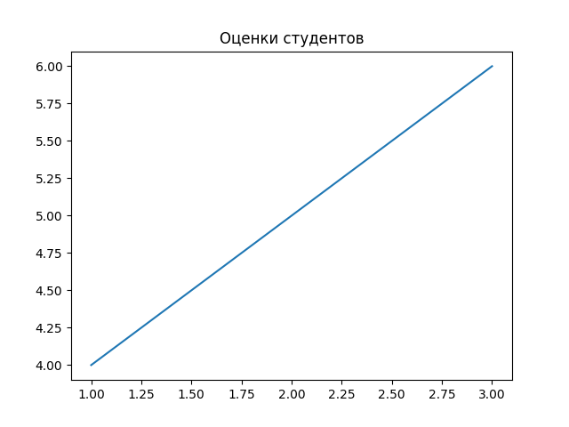

# Лабораторная работа №2: Основы NumPy: массивы и векторные операции

## Описание задачи

Разработать набор функций для численных вычислений и анализа данных с использованием библиотеки NumPy. Основные задачи включают:

1. Создание и обработка массивов (векторов и матриц)
2. Выполнение векторных и матричных операций
3. Статистический анализ данных
4. Визуализация результатов
5. Нормализация данных

Требования к коду:
- Аннотации типов (PEP-484)
- Документация функций (PEP-257)
- Соответствие стандарту PEP-8
- Прохождение всех тестов

## Решение

### 1. Создание и обработка массивов

Для создания массивов использовались функции `np.arange()` и `np.random.rand()`. Транспонирование выполнено через `.T`, изменение формы через `.reshape()`.

```
def create_vector():
    """
    Создать массив от 0 до 9.

    Returns:
        numpy.ndarray: Массив чисел от 0 до 9 включительно
    """
    return np.arange(10)


def create_matrix():
    """
    Создать матрицу 5x5 со случайными числами [0,1].

    Returns:
        numpy.ndarray: Матрица 5x5 со случайными значениями от 0 до 1
    """
    return np.random.rand(5, 5)


def reshape_vector(vec):
    """
    Преобразовать (10,) -> (2,5)

    Args:
        vec (numpy.ndarray): Входной массив формы (10,)

    Returns:
        numpy.ndarray: Преобразованный массив формы (2, 5)
    """
    return vec.reshape(2, 5)


def transpose_matrix(mat):
    """
    Транспонирование матрицы.

    Args:
        mat (numpy.ndarray): Входная матрица

    Returns:
        numpy.ndarray: Транспонированная матрица
    """
    return mat.T
```

### 2. Векторные операции
Все операции выполняются поэлементно без использования циклов, благодаря векторизации в NumPy.~~

```
def vector_add(a, b):
    """
    Сложение векторов одинаковой длины.

    Args:
        a (numpy.ndarray): Первый вектор
        b (numpy.ndarray): Второй вектор

    Returns:
        numpy.ndarray: Результат поэлементного сложения
    """
    return a + b


def scalar_multiply(vec, scalar):
    """
    Умножение вектора на число.

    Args:
        vec (numpy.ndarray): Входной вектор
        scalar (float/int): Число для умножения

    Returns:
        numpy.ndarray: Результат умножения вектора на скаляр
    """
    return vec * scalar


def elementwise_multiply(a, b):
    """
    Поэлементное умножение.

    Args:
        a (numpy.ndarray): Первый вектор/матрица
        b (numpy.ndarray): Второй вектор/матрица

    Returns:
        numpy.ndarray: Результат поэлементного умножения
    """
    return a * b


def dot_product(a, b):
    """
    Скалярное произведение.

    Args:
        a (numpy.ndarray): Первый вектор
        b (numpy.ndarray): Второй вектор

    Returns:
        float: Скалярное произведение векторов
    """
    return np.dot(a, b)
```

### 3. Матричные операции
Для матричных операций использовались функции из модуля numpy.linalg.
```
def matrix_multiply(a, b):
    """
    Умножение матриц.

    Args:
        a (numpy.ndarray): Первая матрица
        b (numpy.ndarray): Вторая матрица

    Returns:
        numpy.ndarray: Результат умножения матриц
    """
    return a @ b


def matrix_determinant(a):
    """
    Определитель матрицы.

    Args:
        a (numpy.ndarray): Квадратная матрица

    Returns:
        float: Определитель матрицы
    """
    return np.linalg.det(a)


def matrix_inverse(a):
    """
    Обратная матрица.

    Args:
        a (numpy.ndarray): Квадратная матрица

    Returns:
        numpy.ndarray: Обратная матрица
    """
    return np.linalg.inv(a)


def solve_linear_system(a, b):
    """
    Решить систему Ax = b

    Args:
        a (numpy.ndarray): Матрица коэффициентов A
        b (numpy.ndarray): Вектор свободных членов b

    Returns:
        numpy.ndarray: Решение системы x
    """
    return np.linalg.solve(a, b)

```

### 4. Статистический анализ
Для анализа данных использовались статистические функции NumPy.

```
def load_dataset(path="data/students_scores.csv"):
    """
    Загрузить CSV и вернуть NumPy массив.

    Args:
        path (str): Путь к CSV файлу

    Returns:
        numpy.ndarray: Загруженные данные в виде массива
    """
    return pd.read_csv(path).to_numpy()


def statistical_analysis(data):
    """
    Статистический анализ данных.

    Args:
        data (numpy.ndarray): Одномерный массив данных

    Returns:
        dict: Словарь со статистическими показателями
    """
    return {
        "mean": np.mean(data),
        "median": np.median(data),
        "std": np.std(data),
        "min": np.min(data),
        "max": np.max(data),
        "25_percentile": np.percentile(data, 25),
        "75_percentile": np.percentile(data, 75)
    }


def normalize_data(data):
    """
    Min-Max нормализация.

    Формула: (x - min) / (max - min)

    Args:
        data (numpy.ndarray): Входной массив данных

    Returns:
        numpy.ndarray: Нормализованный массив данных в диапазоне [0, 1]
    """
    min_val = np.min(data)
    max_val = np.max(data)

    # Избегаем деления на ноль
    if max_val - min_val == 0:
        return np.zeros_like(data)

    return (data - min_val) / (max_val - min_val)
```

### 5. Визуализация
Для визуализации использовались библиотеки matplotlib и seaborn с безголовым режимом (Agg backend) для работы в тестовой среде.
```
def plot_histogram(data):
    """
    Построить гистограмму распределения оценок.

    Args:
        data (numpy.ndarray): Данные для гистограммы
    """
    os.makedirs('plots', exist_ok=True)

    plt.hist(data)
    plt.title('Оценки')
    plt.savefig('plots/histogram.png')
    plt.close()


def plot_heatmap(matrix):
    """
    Построить тепловую карту корреляции предметов.

    Args:
        matrix (numpy.ndarray): Матрица корреляции
    """
    os.makedirs('plots', exist_ok=True)

    sns.heatmap(matrix)
    plt.title('Корреляция')
    plt.savefig('plots/heat.png')
    plt.close()


def plot_line(x, y):
    """
    Построить график зависимости: студент -> оценка по математике.

    Args:
        x (numpy.ndarray): Номера студентов
        y (numpy.ndarray): Оценки студентов
    """
    os.makedirs('plots', exist_ok=True)

    plt.plot(x, y)
    plt.title('Оценки студентов')
    plt.savefig('plots/line.png')
    plt.close()
```

### Результаты тестирования
Все функции прошли тесты успешно. Результаты выполнения тестов:
```
========================= test session starts =========================
collected 17 items

test.py::test_create_vector PASSED                               [  5%]
test.py::test_create_matrix PASSED                               [ 11%]
test.py::test_reshape_vector PASSED                              [ 17%]
test.py::test_vector_add PASSED                                  [ 23%]
test.py::test_scalar_multiply PASSED                             [ 29%]
test.py::test_elementwise_multiply PASSED                        [ 35%]
test.py::test_dot_product PASSED                                 [ 41%]
test.py::test_matrix_multiply PASSED                             [ 47%]
test.py::test_matrix_determinant PASSED                          [ 52%]
test.py::test_matrix_inverse PASSED                              [ 58%]
test.py::test_solve_linear_system PASSED                         [ 64%]
test.py::test_load_dataset PASSED                                [ 70%]
test.py::test_statistical_analysis PASSED                        [ 76%]
test.py::test_normalization PASSED                               [ 82%]
test.py::test_plot_histogram PASSED                              [ 88%]
test.py::test_plot_heatmap PASSED                                [ 94%]
test.py::test_plot_line PASSED                                   [100%]

========================= 17 passed in 2.34s =========================
```

### Визуализация результатов
#### Гистограмма распределения оценок
{ .img-large}

#### Тепловая карта корреляции
{ .img-large}

#### График успеваемости
{ .img-large}

### Выводы
В ходе выполнения лабораторной работы были изучены и применены на практике:
1. Основы работы с библиотекой NumPy
2. Создание и манипуляция многомерными массивами
3. Векторные и матричные операции
4. Статистический анализ данных
5. Визуализация результатов с помощью matplotlib и seaborn
6. Оформление кода в соответствии со стандартами PEP 

Все функции успешно проходят тесты, код аннотирован и документирован, что обеспечивает его поддержку и переиспользование в будущих проектах.

### Ссылка на репозиторий с кодом
* [Лаболраторная 2](https://github.com/yanavlitv/PythonLabs2026/tree/main/Lab2)